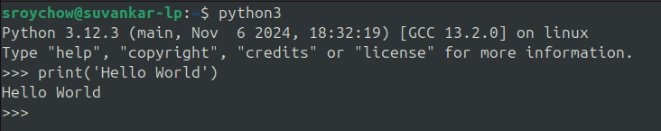
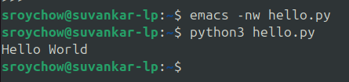

# Python

Python is a high-level, general-purpose programming language. Its design philosophy emphasizes code readability with the use of significant indentation. [Wikipedia](https://en.wikipedia.org/wiki/Python_(programming_language))

# Trivia

*  Conceived in 1980s by Guido van Rossum at Centrum Wiskunde & Informatica (CWI) in the Netherlands.
*  The language is named after one of Guido’s favourite programs “Monty Pythons Flying Circus”, a classic British comedy sketch show originally running from 1969 to 1974.
* Currently there are two main versions of Python called Python 2 and Python 3.
* Python 2 was launched in October 2000 and has been, and still is, very widely used.
* Python 3 was launched in December 2008 and is a major revision to the language that is not backward compatible.
* Python 3 is the future of the Python language and we shall follow this standard in practice.
* The [Zen of Python](https://en.wikipedia.org/wiki/Zen_of_Python) lists out the essential philosophy of python as a programming language.

# Why python is popular?

* Easy to learn.
* Ability to run on (almost) any operating system, especially on Linux, Windows, MacOS.
* Ability to be used as a scripting language - finds usage in developing Web applications.
* Huge collection of libraries created for the use in scientific community, e.g. [Numpy](https://numpy.org/), [SciPy](https://scipy.org/) etc. Finds usage in Data Science, Machine Learning community.
* It's Free!!!!!

# What shall you learn?

Firstly, you will learn about basics of python programming. Next, we shall move on to solving linear as well as non linear systems, interpolation and polynomial approximation techniques, numerical differentiation and integration techniques, solution methods for ordinary and partial differential equations etc. We shall choose problems from different areas of physics. Eventually, we shall also learn about data visualization.

# Saliant features of Python

* Python is an example of a hybrid programming language - as it allows the user to write procedural code, to use objects in an object oriented manner, and to write functional programs.

* Python uses dynamic type.

* Python is not a precompiled language in the way that some other languages, it is interpreted (Execution model to be discussed in class). The way a Python interpretar works at runtime is explained below in brief:-
  * At first the program is checked for syntax errors.
  * The human readable code is compiled into an intermediate machine code. (we shall see files with _.pyc_ extension)/
  * The compiled intermediate version is executed by the interpreter.

# How to execute a Python code?

There are several ways in which you can run a Python program - (show in class)
* Interactively using the Python interpreter.
* Stored in a fiile and run using the Python command (usual convension is to save the file with _.py_ extension)
* Run as a script fiile specifying the Python interpreter to use within the script fiile

# Now let's code

## First python program

Let's begin the journey with a very small piece of code, which is a tradition when learning a new language. So the job is to print out a message - Hello World. The syntax is, 

```
print('Hello World')
```

Shown are two ways to execute it-

Running interactively


Running via script


### Taking user input

Let's take some input from the user, and then print it on the screen. Syntax is below,

```
user_name = input('Enter your name: ')
print('Hello ', user_name)
```

* Here, user_name is a variable used to store the value of the input given by the user. A variable is a named area of the computers’ memory used to hold some data (strings, integers, float, boolean etc)

# Variables

Let's look at the following snippet and understand what's happening.

```
dummy = 'UPES'
print('University Name:', user_name)
print(type(dummy))
```
The output of this snippet is,
```
UPES
<class 'str'>
```

Here, the variable _dummy_ is being assigned a _string_ value. The **type()** is an in-built python function, which tells what is the type of any object. Common built-in python types,

| Type         | Value description | Mutability |
|:-------------|:------------------|:-----------|
| bool         | Boolean Value     |     No     |
|:-------------|:------------------|:-----------|
| complex      | Complex number with Real and Imaginary parts     |     No     |
|:-------------|:------------------|:-----------|
| int | Integer numbers | No |
|:-------------|:------------------|:-----------|
| float | Double-precision floating-point number. | No
|:-------------|:------------------|:-----------| 
| list | A collection of same or mixed type | Yes |
|:-------------|:------------------|:-----------|
| dict| Associative array of key and value pairs. Can contain mixed types. | Yes |
|:-------------|:------------------|:-----------|

In object-oriented (OO) and functional programming, an immutable object is an object whose state cannot be modified after it is created.

## Dynamic type

```
dummy = 'UPES'
print('University Name:', dummy)
print(type(dummy))
dummy = 2025
print('Year:', dummy)
print(type(dummy))
```
The output of this snippet is,

```
UPES
<class 'str'>
2025
<class 'int'>
```